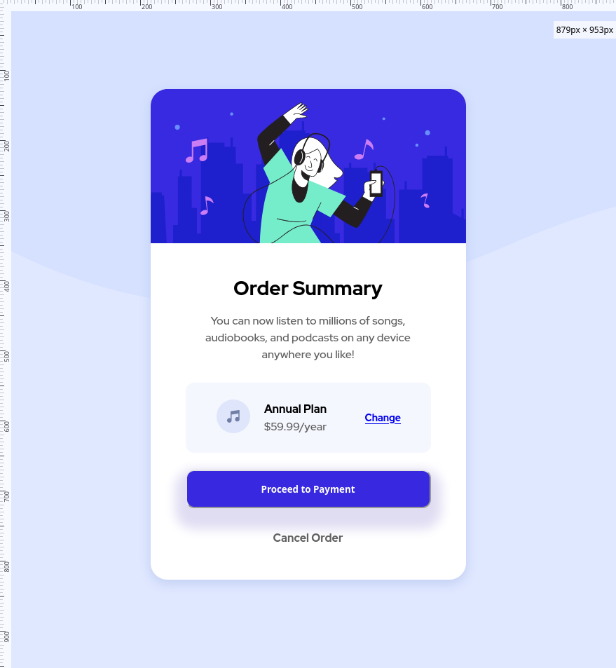

# Frontend Mentor - Order summary card solution

## Overview

### The challenge

Users should be able to:

- See hover states for interactive elements

### Screenshot

### What I learned

Not sure I learned anything new. It was more in I got more experience in doing which is about just as good. I guess I learned to edit my css right in the inspector to experiment with my values.
